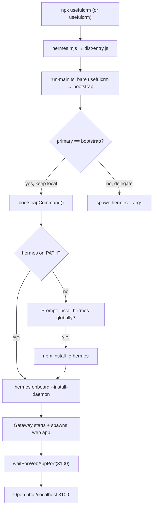

# UsefulCRM Bootstrap: Clean Separation and Dev Testing

## Architecture

UsefulCRM is a frontend/UI/skills layer. Hermes is a separate, globally-installed runtime. UsefulCRM should NEVER bundle or run a local copy of Hermes.



The bootstrap flow is correctly wired:

- Bare `usefulcrm` rewrites to `usefulcrm bootstrap`
- `bootstrap` is never delegated to global `hermes`
- `bootstrapCommand` calls `ensureHermesCliAvailable` which prompts to install
- Onboarding sets `gateway.webApp.enabled: true`
- Gateway starts the Next.js standalone server on port 3100
- Bootstrap probes and opens the browser

## Problem 1: Local Hermes paths in web app (must remove)

`[apps/web/lib/agent-runner.ts](apps/web/lib/agent-runner.ts)` has `resolveHermesLaunch` which, when `DENCHCLAW_USE_LOCAL_OPENCLAW=1`, resolves a local `scripts/run-node.mjs` or `hermes.mjs` and spawns it with `node`. This contradicts the architecture: UsefulCRM should always spawn the global `hermes` binary.

The same pattern exists in `[apps/web/lib/subagent-runs.ts](apps/web/lib/subagent-runs.ts)` where `sendGatewayAbortForSubagent` and `spawnSubagentMessage` hardcode `node <local-script>` paths.

**Fix:**

- Remove `DENCHCLAW_USE_LOCAL_OPENCLAW`, `resolveHermesLaunch`, `resolvePackageRoot`, and `HermesLaunch` type from `agent-runner.ts`
- All spawn calls become `spawn("hermes", [...args], { env, stdio })`
- In `subagent-runs.ts`: replace `node <scriptPath> gateway call ...` with `hermes gateway call ...`
- Remove `resolvePackageRoot` import from `subagent-runs.ts`

## Problem 2: `pnpm hermes` script name is wrong

`package.json` has `"hermes": "node scripts/run-node.mjs"`. This repo IS UsefulCRM, not Hermes.

**Fix:** Rename to `"usefulcrm": "node scripts/run-node.mjs"`. Also `"hermes:rpc"` to `"usefulcrm:rpc"`.

## Dev workflow (after fixes)

```bash
# Prerequisite: install Hermes globally (one-time)
npm install -g hermes

# Run UsefulCRM bootstrap (installs/configures everything, opens UI)
pnpm usefulcrm

# Or for web UI dev only:
hermes --profile usefulcrm gateway --port 18789   # Terminal 1
pnpm web:dev                                        # Terminal 2
```

## Implementation details

### 1. Simplify agent-runner.ts spawning

Remove ~40 lines (`resolvePackageRoot`, `HermesLaunch`, `resolveHermesLaunch`). Both `spawnLegacyAgentProcess` and `spawnLegacyAgentSubscribeProcess` become:

```typescript
function spawnLegacyAgentProcess(message: string, agentSessionId?: string) {
  const args = ["agent", "--agent", "main", "--message", message, "--stream-json"];
  if (agentSessionId) {
    const sessionKey = `agent:main:web:${agentSessionId}`;
    args.push("--session-key", sessionKey, "--lane", "web", "--channel", "webchat");
  }
  const profile = getEffectiveProfile();
  const workspace = resolveWorkspaceRoot();
  return spawn("hermes", args, {
    env: {
      ...process.env,
      ...(profile ? { OPENCLAW_PROFILE: profile } : {}),
      ...(workspace ? { OPENCLAW_WORKSPACE: workspace } : {}),
    },
    stdio: ["ignore", "pipe", "pipe"],
  });
}
```

### 2. Simplify subagent-runs.ts spawning

`sendGatewayAbortForSubagent` and `spawnSubagentMessage` both have this pattern:

```typescript
const root = resolvePackageRoot();
const devScript = join(root, "scripts", "run-node.mjs");
const prodScript = join(root, "hermes.mjs");
const scriptPath = existsSync(devScript) ? devScript : prodScript;
spawn("node", [scriptPath, "gateway", "call", ...], { cwd: root, ... });
```

Replace with:

```typescript
spawn("hermes", ["gateway", "call", ...], { env: process.env, ... });
```

### 3. Update agent-runner.test.ts

- Remove `process.env.DENCHCLAW_USE_LOCAL_OPENCLAW = "1"` from `beforeEach`
- Remove entire `resolvePackageRoot` describe block (~5 tests)
- The "uses global hermes by default" test becomes the only spawn behavior test
- Update mock assertions: command is always `"hermes"`, no `prefixArgs`

### 4. Rename package.json scripts

```diff
-    "hermes": "node scripts/run-node.mjs",
-    "hermes:rpc": "node scripts/run-node.mjs agent --mode rpc --json",
+    "usefulcrm": "node scripts/run-node.mjs",
+    "usefulcrm:rpc": "node scripts/run-node.mjs agent --mode rpc --json",
```
