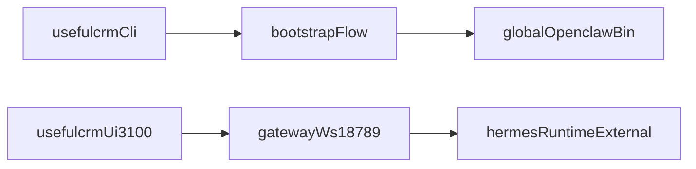

# Strict External Hermes Cutover

## Goal

- Make this repository UsefulCRM-only.
- Remove Hermes core runtime code from this repo.
- Depend on globally installed `hermes` (peer/global model), not bundled source.
- Keep UsefulCRM UX: `npx usefulcrm` bootstrap + UI on `3100` over gateway `18789`.

Reference upstream runtime source of truth: [hermes/hermes](https://github.com/hermes/hermes).

## Non-Negotiable Constraints

- No vendored Hermes core runtime in this repo after cutover.
- `hermes` consumed as global binary requirement (peer + global install), not shipped here.
- UsefulCRM must communicate with Hermes only via stable external contracts:
  - `hermes` CLI commands
  - Gateway WebSocket protocol

## Target Architecture

## Phase 1: Define UsefulCRM-Only Boundary

- Keep only UsefulCRM-owned surfaces:
  - product layer and branding
  - bootstrap/orchestration CLI
  - web UI and workspace UX
- Mark Hermes-owned modules for removal from this repo.
- Primary files to re-boundary:
  - [package.json](package.json)
  - [hermes.mjs](hermes.mjs)
  - [src/cli/run-main.ts](src/cli/run-main.ts)
  - [src/cli/bootstrap.ts](src/cli/bootstrap.ts)
  - [src/product/adapter.ts](src/product/adapter.ts)

## Phase 2: Replace Internal Core Imports With External Contracts

- Remove all `apps/web` / `ui` imports that currently reach into local Hermes source internals.
- Re-implement required behavior in UsefulCRM-local adapters using gateway protocol + local helpers.
- First critical edge:
  - [apps/web/lib/agent-runner.ts](apps/web/lib/agent-runner.ts)
- Also migrate `ui/src/ui/**` consumers that import `../../../../src/*` internals.

## Phase 3: CLI Delegation Model

- Make UsefulCRM CLI own only bootstrap/product UX.
- Delegate non-bootstrap command execution to global `hermes` binary.
- Keep rollout/fallback env gates while switching default to external execution.
- Primary files:
  - [src/cli/run-main.ts](src/cli/run-main.ts)
  - [src/cli/run-main.test.ts](src/cli/run-main.test.ts)
  - [src/cli/bootstrap.ts](src/cli/bootstrap.ts)

## Phase 4: Package + Dependency Model (Peer + Global)

- Update package metadata so UsefulCRM does not bundle Hermes runtime code.
- Add peer requirement/documentation for global `hermes` presence.
- Ensure bootstrap validates and remediates missing global CLI (`npm i -g hermes`).
- Primary files:
  - [package.json](package.json)
  - [docs/reference/RELEASING.md](docs/reference/RELEASING.md)
  - install/update docs under `docs/`

## Phase 5: Remove Hermes Core Source From Repo

- Delete Hermes-owned runtime modules from this repository once delegation and adapters are complete.
- Retain only UsefulCRM package code and tests.
- Remove obsolete build/release scripts that assume monolithic runtime shipping.
- Primary files/areas:
  - `src/` (Hermes runtime portions)
  - scripts that package core runtime artifacts
  - compatibility shims that re-export local Hermes code

## Phase 6: Build/Release Pipeline Realignment

- Adjust build outputs to ship UsefulCRM only.
- Remove checks that require bundled Hermes dist artifacts.
- Keep web standalone packaging + bootstrap checks.
- Primary files:
  - [tsdown.config.ts](tsdown.config.ts)
  - [scripts/release-check.ts](scripts/release-check.ts)
  - [scripts/deploy.sh](scripts/deploy.sh)

## Verification Gates

- `pnpm tsgo`, lint, and formatting pass after source removals.
- Unit/e2e coverage for:
  - bootstrap diagnostics and remediation
  - command delegation to global `hermes`
  - gateway streaming from UsefulCRM UI
- End-to-end smoke:
  - clean machine with only global `hermes`
  - `npx usefulcrm` bootstrap succeeds
  - UI works on `3100`, gateway on `18789`, no profile/daemon collisions.

## Rollout Safety

- Keep emergency fallback env switch for one release window.
- Remove fallback after successful release telemetry and smoke matrix pass.
